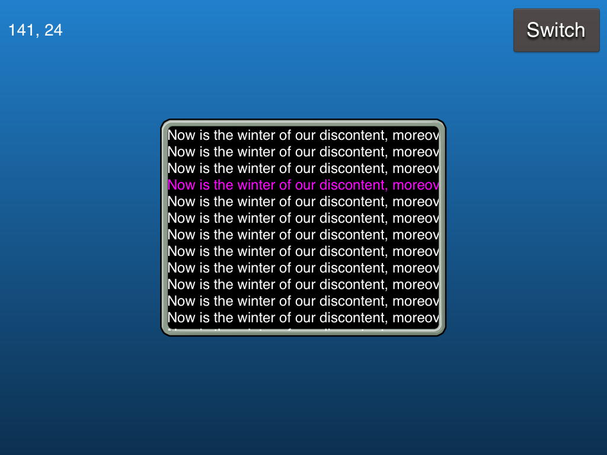

Scrolling CCClippingNode Example
================================

The [docs for CCClippingNode](http://www.cocos2d-swift.org/docs/api/Classes/CCClippingNode.html) are a bit terse
and it can be hard to get a basic example up and running.  Feel free to use this a tutorial or example.

This was built with Cocos2D v3.2.

CCClippingNode gotchas
----------------------

The basic steps to getting a clipping node with a sub-view up and running is:

* Add the stencil enabling code, eg in AppDelegate.m in `application:didFinishLaunchingWithOptions:`

        // Using CCClippingNode requires stencil to be on
        NSNumber *num = [NSNumber numberWithUnsignedInt:GL_DEPTH24_STENCIL8_OES];
        [cocos2dSetup setObject:num forKey:CCSetupDepthFormat];

* Create a stencil shape - its easiest to use one set up in a CCB file.  If you have rectangular area
just use a CCNodeColor as in this example.  Make sure you have a reference to it eg:

        CCNodeColor *_stencil;

* Note that any shaped image can be used as a `_stencil`.  Its best not to use one with any alpha values
so watch out for anti-aliasing along the edges.

* Setup the CCClippingNode with the stencil, set its alpha and add it to your scene:

        CCClippingNode *clippingNode = [CCClippingNode clippingNodeWithStencil:_stencil];
        [clippingNode setAlphaThreshold:0.0f];
        [self addChild:clippingNode];

* Add the scrolling content to the clipping node:

        CCNode *content = [CCBReader load:@"MyContent"];
        [clippingNode addChild:content];

* Problems to watch for are:

    * The offsets appear wrong - this is because the origin of the clipping node is at (0,0)
      and your stencil only shows content when it is inside the area of the stencil, which
      is probably positioned at > 0,0

    * If you position your CCClippingNode somewhere other than 0,0 you may have issues as the
      clipping area of your _stencil is relative to the CCClippingNode and won't appear where
      you expect.
 
    * Objects that use relative positioning and sizing can be problematic.  It might be
      easiest to convert them to their UIPoint equivalent.

    
